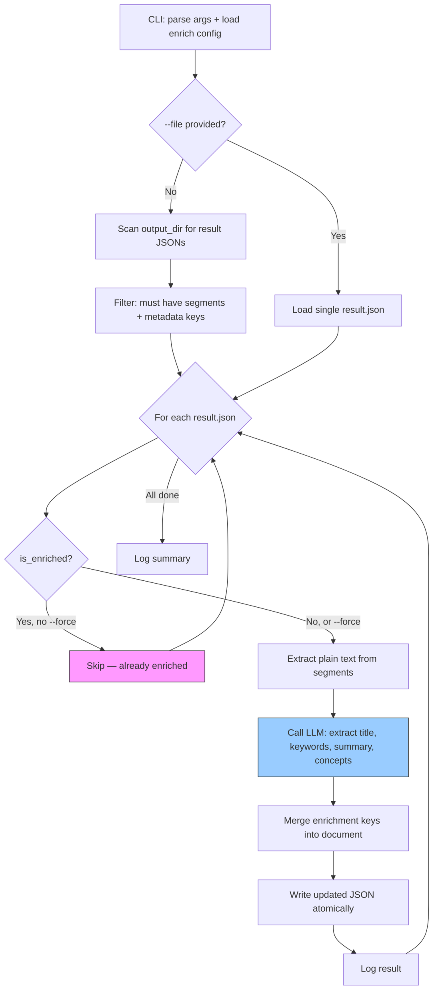
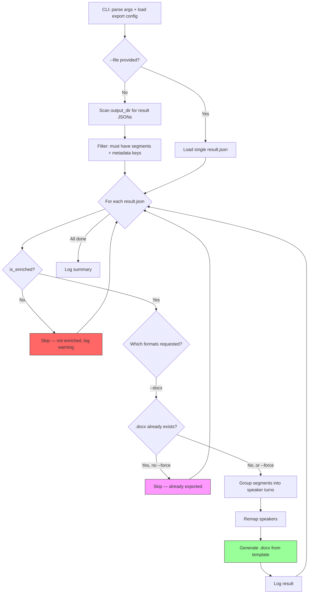

# Design Document

## Overview

Transskribo is a CLI tool that wraps WhisperX to batch-process audio files
with transcription and speaker diarization. It processes files sequentially,
skips already-processed files, detects duplicates by content hash, and
produces structured JSON output mirroring the input directory tree.

## Architecture Decisions

### 1. Sequential Processing

**Decision:** Process one file at a time, no concurrency.

**Rationale:** WhisperX fully utilizes the GPU for each file. Parallelism
would cause OOM errors on 8GB VRAM with 1-3 hour audio files. Sequential
processing is simpler, easier to debug, and provides predictable memory usage.

### 2. Config File + CLI Override

**Decision:** TOML config file as base, CLI flags override any config value.

**Rationale:** TOML is human-readable, natively supported in Python 3.12+,
and well-suited for nested configuration. CLI overrides allow one-off
adjustments without editing the config file. Merging order:
defaults → config file → CLI flags.

### 3. Lazy Hash-Based Duplicate Detection

**Decision:** Compute SHA-256 hash at processing time, check against a
registry of previously seen hashes.

**Rationale:** Pre-computing hashes for thousands of multi-hour audio files
would add significant startup time. Lazy computation means we only hash
each file when we're about to process it. If a hash match is found, we
copy the existing output instead of re-transcribing.

### 4. File-Based State (Registry)

**Decision:** JSON file at `<output_dir>/.transskribo/registry.json` stores
all processing state.

**Rationale:** No external dependencies (no database). Easy to inspect,
back up, and version. Atomic writes (write to temp, then rename) prevent
corruption. The registry is small even for thousands of files.

### 5. Isolated WhisperX Wrapper

**Decision:** All WhisperX interaction lives in `transcriber.py`.

**Rationale:** WhisperX's API may change between versions. Isolating it in
one module means the rest of the codebase is unaffected by upstream changes.
It also makes testing easier — other modules can be tested without a GPU.

### 6. Per-File Model Swapping

**Decision:** Load and unload GPU models per processing stage within each
file. Do NOT keep all models in VRAM simultaneously.

**Rationale:** WhisperX uses three models at different stages:

| Stage      | Model         | Approx VRAM (float16) |
|------------|---------------|-----------------------|
| Transcribe | Whisper       | ~3-4 GB               |
| Align      | wav2vec2      | ~1 GB                 |
| Diarize    | pyannote      | ~1-2 GB               |

On an 8 GB RTX 4060, loading all three simultaneously (~6-7 GB) risks OOM
when intermediate tensors are allocated during processing of long audio.

The safe approach, recommended by the WhisperX README itself, is:
1. Load Whisper model → transcribe → align → delete model + `torch.cuda.empty_cache()`
2. Load pyannote pipeline → diarize → assign speakers → delete pipeline + `torch.cuda.empty_cache()`
3. Write output → next file

Model loading adds ~5-10 seconds per file, which is negligible against
1-3 hours of audio processing time. Each file is fully self-contained —
no intermediate state carries over between files.

The alternative (batch by stage: transcribe ALL files, then diarize ALL)
was rejected because it requires storing thousands of intermediate results
and a crash mid-diarization loses the association with transcription output.

### 7. Broad Format Support via ffprobe Validation

**Decision:** Accept any file with an audio stream (detected by ffprobe),
not just a hardcoded list of extensions. Use ffprobe to validate files
before processing.

**Rationale:** WhisperX loads audio via ffmpeg, so it can handle any format
ffmpeg supports. Rather than maintaining a narrow extension whitelist, we
accept a broad set of known audio/video extensions and then validate each
file with ffprobe before processing. This handles:
- Corrupt or zero-length files (ffprobe fails → skip)
- Video files with audio tracks (ffprobe confirms audio stream → process)
- Misnamed files (wrong extension but valid audio → processed if extension is in supported list)
- Files without audio streams (ffprobe finds no audio → skip)

ffprobe also provides duration, which enables the `max_duration_hours`
safety valve and feeds into the `duration_audio_secs` registry field.

ffmpeg/ffprobe is already a transitive dependency of WhisperX, so this
adds no new system requirements.

Supported extensions (case-insensitive):
- **Audio:** `.mp3`, `.m4a`, `.wav`, `.flac`, `.ogg`, `.opus`, `.wma`, `.aac`
- **Video:** `.mp4`, `.mkv`, `.avi`, `.webm`, `.mov`, `.wmv`

### 8. JSON Output Format

**Decision:** JSON as the primary output format, containing word-level
timestamps, segment-level timestamps, speaker labels, and metadata.

**Rationale:** JSON is the richest format WhisperX produces. It preserves
all information (word timing, segment timing, speaker assignment) in a
structured, parseable format. Metadata (duration, speaker count, model
used, processing time) is added as a top-level field.

## Module Breakdown

### `cli.py` — Entry Point

- Defines the Typer app with subcommands: `run`, `report`, `enrich`, `export`, `version`
- `run`: main batch processing pipeline
- `report`: generate statistics from registry without processing
- `enrich`: post-process transcriptions with LLM concept extraction (updates JSON)
- `export`: generate output artifacts from enriched transcriptions (e.g. .docx)
- Parses CLI flags, loads config, delegates to pipeline

### `config.py` — Configuration

- Defines `TransskriboConfig` dataclass with all settings
- Loads TOML file, applies defaults, merges CLI overrides
- Validates paths, checks HF token availability
- Exports a frozen config object used by all other modules

### `scanner.py` — File Discovery

- Walks input directory recursively
- Filters by supported extensions (case-insensitive):
  - Audio: `.mp3`, `.m4a`, `.wav`, `.flac`, `.ogg`, `.opus`, `.wma`, `.aac`
  - Video: `.mp4`, `.mkv`, `.avi`, `.webm`, `.mov`, `.wmv`
- Returns list of `AudioFile` dataclass instances (path, relative path, size)
- Computes the corresponding output path for each file
- Filters out files whose output already exists (skip already processed)

### `validator.py` — File Validation

- Uses ffprobe (subprocess) to validate files before processing
- Checks: file is not zero-length, ffprobe can read it, file has an audio stream
- Extracts metadata: duration (seconds), codec info, number of audio streams
- Returns a `ValidationResult` dataclass: is_valid, duration_secs, error reason
- Enforces `max_duration_hours` config limit (0 = no limit)
- Runs before hashing — invalid files are skipped without wasting time on SHA-256

### `hasher.py` — Hashing & Registry

- Computes SHA-256 of audio files (streaming, memory-efficient)
- Maintains the hash registry (JSON file)
- Registry maps: `hash → {source_path, output_path, timestamp, status, duration_audio_secs, timing: {transcribe_secs, align_secs, diarize_secs, total_secs}, error}`
- Provides lookup: "has this hash been seen before?"
- Provides registration: "record this hash as processed" with full timing data
- Atomic writes to prevent corruption on crash

### `transcriber.py` — WhisperX Wrapper

- Manages GPU memory by loading/unloading models per stage within each file
- Per-file processing flow:
  1. Load Whisper model → transcribe → align → delete model → `torch.cuda.empty_cache()`
  2. Load pyannote pipeline → diarize → assign speakers → delete pipeline → `torch.cuda.empty_cache()`
- `load_audio(audio_path, config) → ndarray`: calls `whisperx.load_audio()`, returns numpy array
- `load_whisper_model(config) → model`: loads Whisper for transcription
- `transcribe(model, audio, config) → raw_result`: runs transcription on loaded audio ndarray
- `align(result, audio, config) → aligned_result`: runs forced alignment on same audio ndarray
- `unload_whisper_model(model)`: deletes model and frees VRAM
- `load_diarization_pipeline(config) → pipeline`: loads pyannote
- `diarize(pipeline, audio_path, config) → diarization`: runs speaker diarization (pyannote loads audio internally)
- `assign_speakers(diarization, aligned) → final_result`: merges speaker labels
- `unload_diarization_pipeline(pipeline)`: deletes pipeline and frees VRAM
- `process_file(audio_path, config) → dict`: orchestrates the full per-file flow:
  1. `load_audio` → audio ndarray (used by transcribe + align)
  2. `load_whisper_model` → `transcribe(model, audio)` → `align(result, audio)` → `unload_whisper_model`
  3. `load_diarization_pipeline` → `diarize(pipeline, audio_path)` → `assign_speakers` → `unload_diarization_pipeline`
- Each step is a separate function for testability and error isolation

### `output.py` — Output Writing

- Creates mirrored directory structure under output dir
- Builds the output JSON document:
  - `segments`: list of segments with start, end, text, speaker, words
  - `words`: flat list of all words with start, end, score, speaker
  - `metadata`: source file, hash, duration, speaker count, model, timestamps
- Writes JSON atomically (temp file + rename)
- Handles duplicate output (copy from existing output, never symlink)

### `reporter.py` — Reports & Statistics

- Reads the registry AND scans the input directory to compute full picture
- Overall progress: total files in input, processed, failed, skipped, duplicates, remaining
- Pipeline stage progress showing the full chain: transcribed → enriched → exported
  - Transcribed: count of result JSONs in output_dir (have segments + metadata)
  - Enriched: count of result JSONs that have all enrichment keys (title, keywords, summary, concepts)
  - Exported per format: count of files with the corresponding artifact (e.g. `.docx` alongside `.json`)
- Timing statistics (from registry timing data):
  - Average, min, max processing time per stage (transcribe, align, diarize)
  - Average total processing time per file
  - Processing speed: average ratio of audio duration to processing time
  - Estimated time remaining (based on avg processing time × remaining files)
- Total audio duration processed vs total audio duration discovered
- Per-directory breakdown (progress, timing, failures per subdirectory)
- Generates both a summary dict and a formatted rich table report
- Can be invoked independently via `transskribo report` (no GPU needed)

### `logging_setup.py` — Logging

- Configures dual handlers: rich stdout + rotating file handler
- Per-file log entries: start, duration, speaker count, status, errors
- Batch-level log entries: total progress, ETA

### `enricher.py` — LLM Concept Extraction

- Extracts plain text from transcription result JSON segments
- Groups consecutive same-speaker segments into speaker turns
- Calls an OpenAI-compatible LLM API to extract structured metadata
- Checks whether a result JSON already has enrichment data (skip logic)
- All LLM interaction is isolated in this module (like `transcriber.py`
  isolates WhisperX)

Functions:
- `extract_text(document: dict) -> str`: concatenates all segment texts
  into a single plain text string
- `group_speaker_turns(document: dict) -> list[dict]`: merges consecutive
  same-speaker segments into turns, each with `speaker` (str) and `texts`
  (list[str]) keys
- `is_enriched(document: dict) -> bool`: returns True if the document
  already contains all enrichment keys (title, keywords, summary, concepts)
- `call_llm(text: str, config: EnrichConfig) -> dict`: sends text to LLM
  via OpenAI SDK (with `base_url`), requests JSON response with title,
  keywords, summary, concepts. Parses and validates the response
- `enrich_document(document: dict, config: EnrichConfig) -> dict`:
  orchestrates extract_text → call_llm → merge enrichment keys into
  document. Returns the updated document

### `docx_writer.py` — Document Generation

- Loads a .docx template using `docxtpl` (Jinja2 for Word documents)
- Fills template context variables and saves the rendered document
- Template context: arquivo, transcritor, data_transcricao, info, segmentos

Functions:
- `generate_docx(output_path: Path, source_name: str, concepts: dict,
  segments: list[dict], config: ExportConfig) -> None`: loads template,
  renders with context, saves to output_path

### 9. Batch Limit Controls (CLI-Only)

**Decision:** Two CLI-only flags (`--max-files`, `--max-minutes`) control
batch size without touching the config file.

**Rationale:** These are operational controls for a specific run, not
permanent settings. A user might want to process 10 files to verify
results, or limit a nightly run to 4 hours. Making them CLI-only avoids
polluting the config with transient session parameters.

**Semantics:**
- `--max-files N`: Stop after N files are successfully **transcribed**
  (result == "processed"). Duplicates, skips, errors, and invalid files
  do NOT count toward the limit. Default 0 = no limit.
- `--max-processing-minutes M`: Stop after M minutes of wall-clock
  processing time have elapsed since the processing loop began (after
  scan + validation). The current file always finishes — the check
  happens before starting the next file. Default 0 = no limit.
- Both checks sit alongside the existing `_shutdown_requested` flag at
  the top of the file loop. When either limit is reached, the loop exits
  cleanly and the batch summary reflects the stop reason.

### 10. Enrich Command: LLM-Powered Concept Extraction

**Decision:** A separate `enrich` command that post-processes transcription
output with an LLM to extract title, keywords, summary, and concepts. The
enrich command only updates the result JSON — it does not generate any
output artifacts.

**Rationale:** Enrichment is a distinct post-processing step that doesn't
require GPU or WhisperX. It depends on an external LLM API and has different
config requirements (no HF token, no CUDA). Separating enrichment from
artifact generation (export) keeps each command focused on one concern:
- `enrich` = LLM interaction, updates JSON with structured metadata
- `export` = artifact generation from enriched data (docx, future formats)

This allows:
- Running enrichment on a different machine (no GPU needed)
- Re-enriching without re-exporting
- Exporting without re-enriching
- Using different LLM providers by changing config
- Processing existing outputs from previous runs
- Batch-enriching all outputs or targeting a single file

### 11. OpenAI-Compatible LLM Interface

**Decision:** Use the `openai` Python SDK with configurable `base_url`,
`api_key`, and `model`.

**Rationale:** The OpenAI chat completions API is a de facto standard
supported by OpenAI, Ollama, vLLM, Together, Groq, and many others.
Using the `openai` SDK with a configurable `base_url` provides maximum
provider flexibility with a single dependency. Users can switch between
cloud and local LLMs by changing three config values, no code changes.

### 12. Docx Template Rendering

**Decision:** Use `docxtpl` (Jinja2 for .docx) with a user-provided
template file at a configurable path.

**Rationale:** The template approach separates content from presentation.
Users can customize the document layout by editing the .docx template
without touching code. The default template at `templates/basic.docx`
provides a catalog card (ficha catalográfica) with metadata, LLM-extracted
concepts, and full transcription organized by speaker turns.

Template variables:
- `arquivo`: source file name
- `transcritor`: transcriber name (configurable)
- `data_transcricao`: export date in dd/mm/yyyy format
- `info`: dict with `title`, `keywords`, `summary`, `concepts`
- `segmentos`: list of speaker turns, each with `speaker` and `texts`

### 13. Enrichment Config Section

**Decision:** Enrich and export have separate config sections: `[enrich]`
for LLM settings and `[export]` for artifact generation settings.

**Rationale:** Each command has different config requirements. The enrich
command needs LLM endpoint configuration, while the export command needs
template paths and document metadata. Splitting `template_path` and
`transcritor` out of `[enrich]` into `[export]` keeps each section
focused on its command. Both commands read `output_dir` from the
top-level config to find result files in batch mode.

Config keys under `[enrich]`:
- `llm_base_url` (default: `"https://api.openai.com/v1"`)
- `llm_api_key` (if empty, the `openai` SDK reads `OPENAI_API_KEY` from env automatically)
- `llm_model` (default: `"gpt-4o-mini"`)

Config keys under `[export]`:
- `template_path` (default: `"templates/basic.docx"`)
- `transcritor` (default: `"Transcrição automática (IA)"`)

### 14. Export Command: Artifact Generation

**Decision:** A separate `export` command that generates output artifacts
from enriched transcription results. Each format is activated by a flag
(e.g., `--docx`). At least one format flag is required.

**Rationale:** Artifact generation is a distinct step from both
transcription and enrichment. Separating it allows:
- Adding new export formats (PDF, SRT, etc.) without touching enrich logic
- Re-exporting with a different template without re-enriching
- Exporting only specific formats in a given run
- Running export on any machine (no GPU, no LLM API needed)

The export command requires enrichment (files must have title, keywords,
summary, concepts). Non-enriched files are skipped with a warning.

**Pipeline:** `transcribe → enrich → export`

**Supported formats (current):**
- `--docx`: generates .docx from template (same logic as previously in enrich)

**Future formats** (not yet implemented):
- `--pdf`, `--srt`, `--txt`, etc. — each would be a new flag

## Data Flow

### Enrich Data Flow

### Export Data Flow

## Error Handling Strategy

### Per-File Errors

Any error during processing of a single file is caught, logged, and the
batch continues to the next file. Errors are recorded in the registry
with status `"failed"` and the error message.

Specific error categories:
- **Validation error** (zero-length, no audio stream, corrupt, over max duration): log reason and skip — file is not registered as "failed" since it was never attempted
- **File read error** (permissions): log and skip
- **WhisperX transcription error** (OOM, model error): log and skip
- **Diarization error** (HF token, model loading): log and skip
- **Output write error** (disk full, permissions): log and skip

### Batch-Level Errors

- **Config file not found / invalid**: fail fast with clear error message
- **Input directory not found**: fail fast
- **No audio files found**: warn and exit cleanly
- **ffprobe not found**: fail fast with message to install ffmpeg
- **GPU not available**: fail fast with message to check CUDA setup
- **HF token missing/invalid**: fail fast before processing starts

### Recovery

- The registry tracks which files succeeded and which failed
- Re-running the tool skips successes and retries failures automatically
- The `--retry-failed` flag can be used to explicitly retry failed files

### Crash Safety

- Output files are written atomically (temp file + rename)
- Registry updates are atomic (write temp + rename)
- A crash mid-file leaves no partial output — the file will be retried
